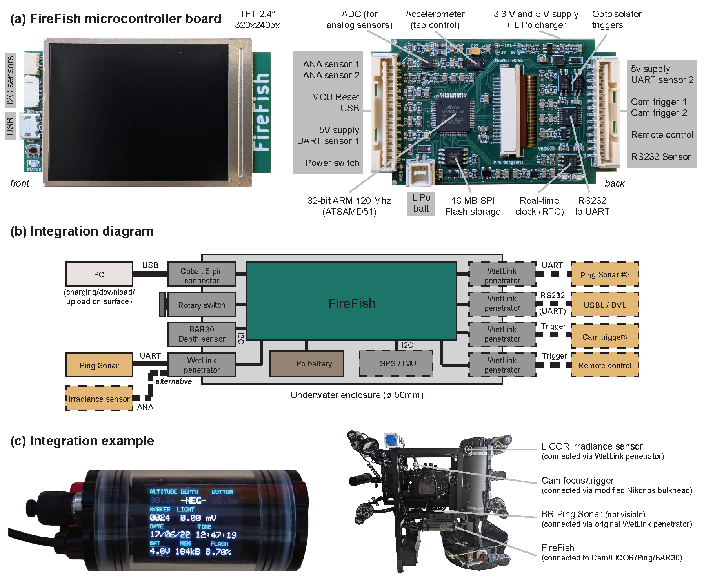
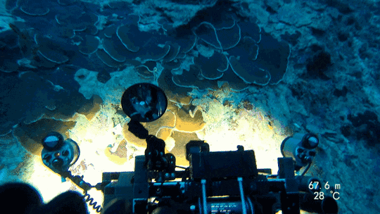
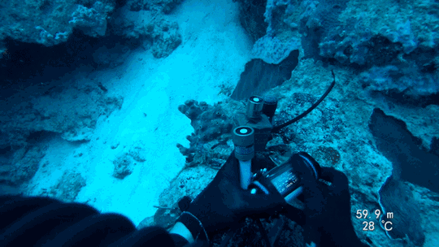
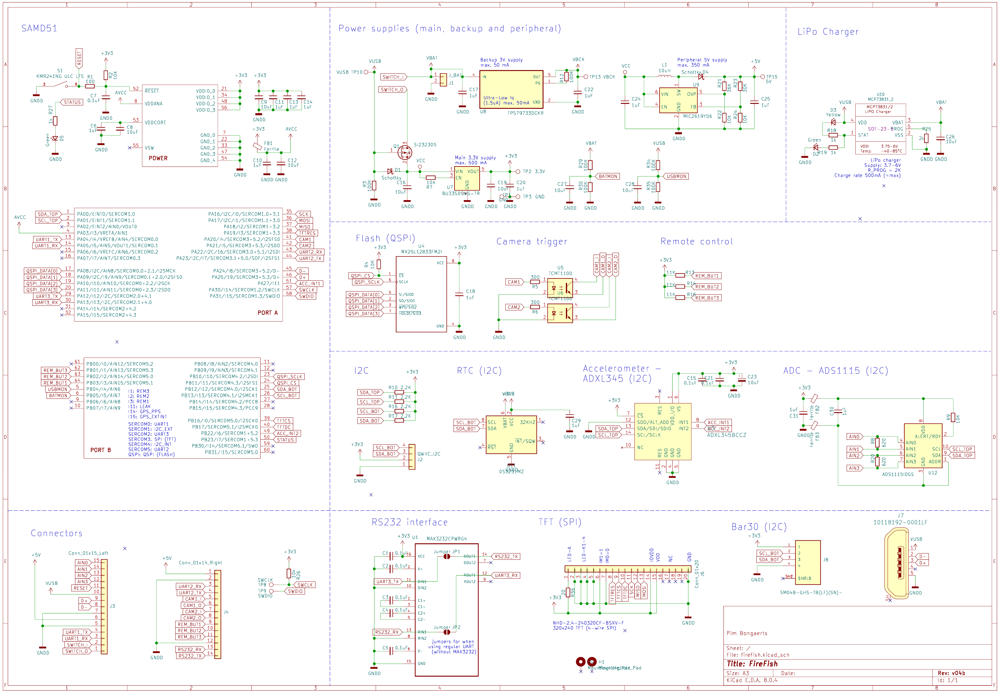

# FireFish

### Real-time feedback &amp; synchronized sensor logging for underwater photogrammetry

An open-source microcontroller board that supports a wide range of sensors, and gives divers real-time
depth/altitude feedback, drives a dual-channel camera intervalometer, and logs time-stamped sensor data —
all inside a standard 2″ underwater housing.

[](LICENSE-HARDWARE.txt)
[](LICENSE-SOFTWARE.txt)
[](LICENSE-DOCS.txt)
[](hardware/)
[](hardware/)
[](#citation)



---

## Overview

FireFish is a compact, low-cost, customizable board that provides (1) **real-time feedback** on depth, altitude,
and other positional data to guide image acquisition; (2) a programmable **dual-channel intervalometer** for one
or two cameras; and (3) **time-stamped logging** that aligns readily with the imagery to orient the resulting 3D
model. Its open design adapts well beyond photogrammetry — e.g. synchronized irradiance measurements or
navigational feedback via acoustic positioning.

<table>
<tr>
<td width="50%" valign="top">

<br><sub><b>Photogrammetry.</b> The diver holds a steady altitude from the live readout while FireFish triggers the camera and logs depth/altitude for 3D-model orientation.</sub>
</td>
<td width="50%" valign="top">

<br><sub><b>Irradiance measurements (alternative implementation).</b> Multiple units log underwater light across reef depth zones; the real-time display lets recordings be accurately time-synchronized across devices.</sub>
</td>
</tr>
</table>

## ✨ Features

- 🎯 **Live depth &amp; altitude** on a 2.4″ TFT — hold a consistent altitude above the substrate during surveys
- 📷 **Dual-channel intervalometer** — focus + shutter for one camera, or alternate-trigger two cameras
- ⏱️ **Synchronized logging** to onboard flash with a temperature-compensated RTC — easy model orientation
- 🔌 **Flexible I/O** — I²C (Qwiic / STEMMA QT), 2× UART, RS-232, and analog inputs (Bar30, Ping sonar, LI-COR, IMU/GNSS, DVL/USBL…)
- 🔋 **Onboard LiPo charging** — charge, download, and update firmware *through* the housing, no opening required
- 🤿 **Dive-ready** — fits standard 2″ (Ø50 mm) housings; depth rating to 225 m
- 💵 **Low cost** — ≈ US$50 in board parts, ≈ US$800 for a complete integrated instrument
- 🛠️ **Fully open** — KiCad design, firmware, enclosure STLs, and an Arduino board-support package

## 🔧 Specifications

| | |
|---|---|
| **Microcontroller** | ATSAMD51J19A — 32-bit Arm Cortex-M4F, 120 MHz, hardware FPU |
| **Display** | 2.4″ TFT, 320 × 240 (ST7789) |
| **Storage** | 16 MB onboard SPI flash (MX25L12833F) |
| **Timekeeping** | DS3231MZ temperature-compensated RTC (battery-backed) |
| **Power** | MCP73831 single-cell LiPo charger; 3.3 V &amp; 5 V rails |
| **Sensing / I/O** | ADS1115 16-bit ADC; I²C, 2× 5 V UART, RS-232 (MAX3232), 2× analog, 3× button |
| **Camera control** | Dual-channel optically-isolated intervalometer (TCMT1100) |
| **Board size** | 72 × 43 mm (two-layer PCB) |
| **Housing** | Standard 2″ (Ø50 mm) BlueRobotics enclosure; depth rating to 225 m |

## 📦 Repository contents

| Folder | Contents |
|---|---|
| [`hardware/`](hardware/) | KiCad 8 project — schematic, PCB layout, Gerbers, BOM, and pick-and-place files |
| [`firmware/`](firmware/) | Arduino board-support package (`firefish_m4_v4b`), an example sketch, and the bootloader |
| [`enclosure/`](enclosure/) | 3D-printable PETG carrier STLs (short / short-simple / long-simple) |
| [`docs/`](docs/) | Figures and documentation |

## Schematic



The full editable schematic is [`hardware/firefish.kicad_sch`](hardware/firefish.kicad_sch) (KiCad 8). *This rendered overview is a placeholder from an earlier revision (rev v01) and will be refreshed.*

## 🛠️ Assembling a FireFish

The full step-by-step build and operation instructions are in the HardwareX article (see [Citation](#citation));
this repository holds the files those instructions refer to:

- [`hardware/`](hardware/) — fabricate and populate the board (Gerbers + [BOM](hardware/firefish_BOM_pcbway2024.csv) + placement files)
- [`firmware/`](firmware/) — flash the bootloader (J-Link) and upload the example sketch over USB
- [`enclosure/`](enclosure/) — print the carrier and integrate into a 2″ housing

## Citation

If you use FireFish, please cite the article:

> Bongaerts, P. (2026). *FireFish: an open-source microcontroller for real-time sensor feedback and data logging in underwater photogrammetry.* **HardwareX** (under review).

```bibtex
@article{Bongaerts2026FireFish,
  author  = {Bongaerts, Pim},
  title   = {FireFish: an open-source microcontroller for real-time sensor
             feedback and data logging in underwater photogrammetry},
  journal = {HardwareX},
  year    = {2026},
  note    = {Under review; DOI to be added}
}
```

> 📌 The archival version of record (design files + firmware) will be deposited to **Zenodo/OSF** with a DOI on
> publication; this GitHub repository is the development mirror.

## ⚖️ License

Open-source hardware, licensed by part (full details in [`LICENSE.md`](LICENSE.md)):

| Part | License |
|---|---|
| **Hardware** — KiCad, Gerbers, STLs, BOM | [CERN-OHL-S v2](LICENSE-HARDWARE.txt) |
| **Software / firmware** — original code | [MIT](LICENSE-SOFTWARE.txt) |
| **Documentation &amp; figures** | [CC BY 4.0](LICENSE-DOCS.txt) |

Third-party firmware keeps its upstream license (Adafruit SAMD core → LGPL-2.1; uf2-samdx1 → MIT; ChaN FatFs → BSD-style). Copyright © 2024–2026 Pim Bongaerts.

<sub>Figures © Pim Bongaerts, reproduced from the FireFish HardwareX article under CC BY 4.0.</sub>

## 🙏 Acknowledgments

Built by learning from the open-source hardware community — in particular **Adafruit** and **SparkFun** — with
generous input from **John Atkins** and **Joey Castillo**. Field testing and deployment were supported by the
**Hope for Reefs Initiative** at the **California Academy of Sciences** and **Inkfish**.
