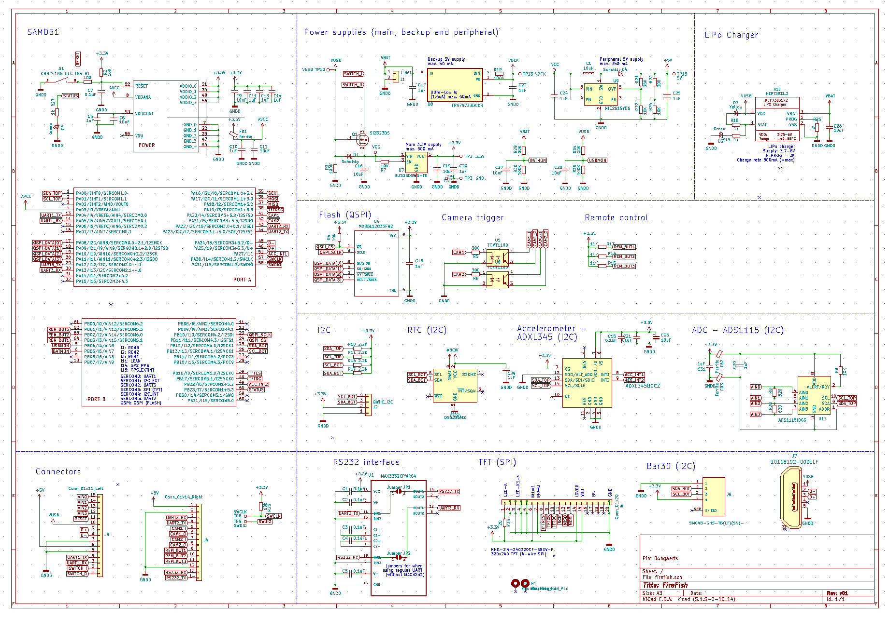

# FireFish

FireFish is an open-source microcontroller (*in development*; v0.4) designed to allow for **real-time evaluation and logging of underwater sensors in scientific diving applications**. It was originally developed to enhance photogrammetry surveys of marine environments through positional feedback (altitude, heading and positioning) and logging of additional metadata associated with individual photographs (e.g. from sonar, IMU, GPS, USBL and/or DVL). However, it can be used for a wide range of underwater applications requiring real-time interaction with sensor data (e.g. irradiance measurements) and/or time synchronization across multiple sensors.

### Features

* 32-bit ARM Cortex-M4F MCU 120MHz (ATSAMD51)
* 256KB of SRAM and 128MB Flash Memory
* 2.4inch high-brightness TFT screen (320x240px)
* Supports a range of sensor communication protocols (UART, I2C, RS232, RS485) (e.g. [Ping Sonar](https://bluerobotics.com/store/sensors-sonars-cameras/sonar/ping-sonar-r2-rp/), [BAR30 Depth](https://bluerobotics.com/store/sensors-sonars-cameras/sensors/bar30-sensor-r1/), [SeaTrac USBL](https://www.blueprintsubsea.com/seatrac/), [DVL A50](https://www.waterlinked.com/dvl), Qwiic/STEMMA boards)
* 3.3V and 5V power supply for external sensors
* Supports analog sensors (16-bit precision) (e.g. [Licor LI-192](https://www.licor.com/env/products/light/quantum_underwater))
* Intervalometer/trigger for two external camera(s)
* Accelerometer for tap/double-tap control (or through a wired 3-button remote control)
* Rechargable Lithium battery (3.7V; e.g. 18650) 
* Supports Arduino (and CircuitPython) for easy programming
* Fits inside [BlueRobotics 2" watertight enclosure](https://bluerobotics.com/product-category/watertight-enclosures/) (see image below), 
* Can be charged, downloaded and reprogrammed using an USB connection while leaving the housing sealed, when using a 6-pin [BlueTrail Bulkhead](https://www.bluetrailengineering.com/product-page/cobalt-series-bulkhead-connector).

### Implementation example #1 - Photogrammetry

Using FireFish acting as an intervalometer for a Canon 5DsR camera used in photogrammetry surveys of shallow and mesophotic coral reef habitats. The FireFish simultaneously records and displays altitude from one or two [Ping Sonars](https://bluerobotics.com/store/sensors-sonars-cameras/sonar/ping-sonar-r2-rp/) and depth from a [BAR30 sensor](https://bluerobotics.com/store/sensors-sonars-cameras/sensors/bar30-sensor-r1/), so that the diver can maintain a consistent altitude (and parallel attitude when using two sonars) of the camera rig to the substrate (to ensure consistent lighting by the 4 underwater strobes), while also recording positional data from the [Seatrac USBL](https://www.blueprintsubsea.com/seatrac/).

### Implementation example #2 - Irradiance measurements

Using multiple FireFish to measure underwater light conditions across and within depth zones of coral reefs. Recordings are marked and start/stopped by double-tapping, and the display allows for positional referencing of the recordings, verification that readings are stabilized, and synchronization of measurements across devices (e.g. comparison with open-water reference).

### Current iteration (v0.4) - Schematic & board

### Acknowledgements

FireFish is designed and developed by [Pim Bongaerts](https://github.com/pimbongaerts). The project would not have been possible without learning from other open source hardware examples (in particular [Adafruit](https://www.adafruit.com/) and [Sparkfun](https://www.sparkfun.com/)), and through generous input from John Atkins and [Joey Castillo](https://github.com/joeycastillo).
