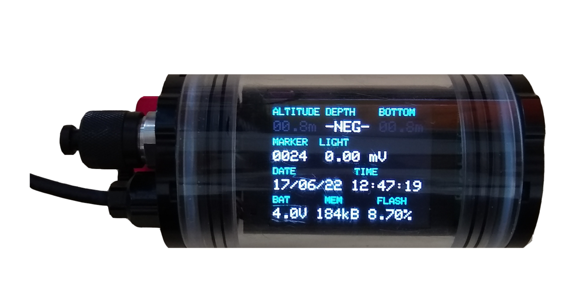

# Firefish

FireFish is a microcontroller board to enable both logging and real-time evaluation of underwater sensors in scientific diving applications. In particular, it is meant to enhance photogrammetry surveys through positional feedback and logging of additional metadata acquired through sonar, IMU, GPS, USBL and/or DVL.

*Features:*

* 32-bit ARM Cortex-M4F MCU 120MHz (ATSAMD51)
* 256KB of SRAM and 128MB Flash Memory
* 2.2 inch TFT screen
* Intervalometer/trigger for two external camera(s)
* Supports UART, I2C, RS232, RS485 sensors
* IMU, GPS and light sensor

* USB charging
* Supports CircuitPython
* Fits inside [BlueRobotics 2" watertight enclosure](https://bluerobotics.com/product-category/watertight-enclosures/) (see image below)

